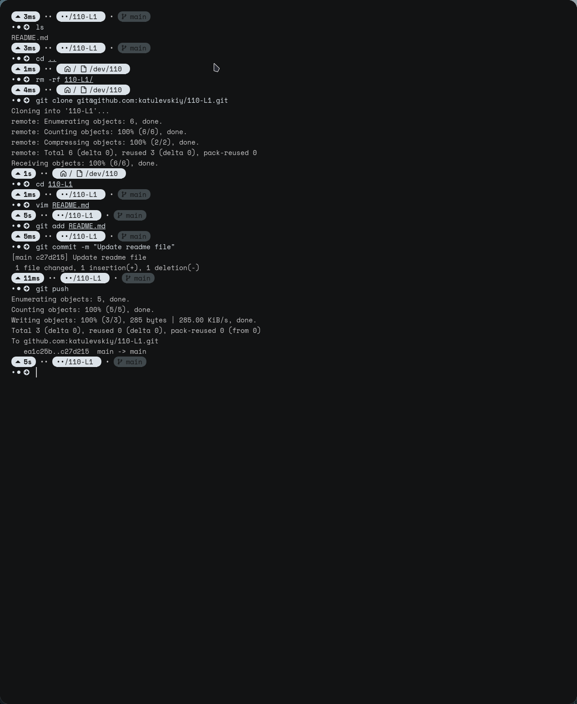
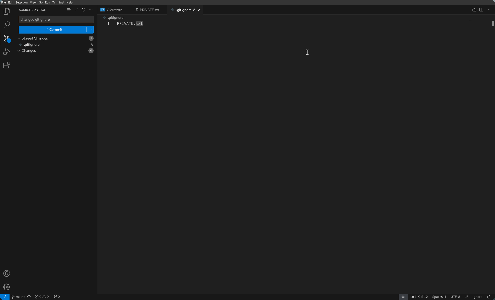

# Lab 1 report

created [readme](./README.md)

## Git commands

**Screenshots** of _commands_


## VSC

Works with `VSCode` as well!

> It's automatic instead of typing commands like

```bash
git commit -m "message"
```



Here is a fun [youtube video](https://www.youtube.com/watch?v=ModPthWa4iA)
If you want, please read it [again](##Git%20commands)

- [x] Task 1
- [x] Task 2
- [x] Task 3
